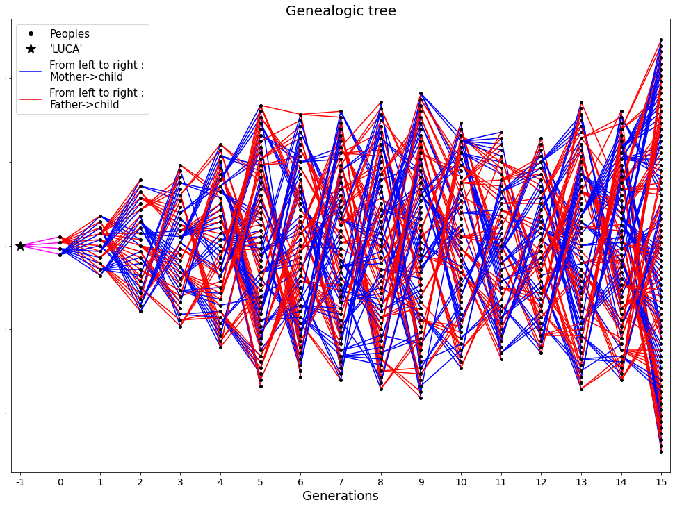

# Modelling-endogamic-depression
In these repository, I will try to model the endogamic depression by creating a population and making it evoluate.

"Inbreeding depression is the reduced biological fitness which has the potential to result from inbreeding (the breeding of related individuals)." Wikipedia

The script are in the Codes folder.
The python script: "populations_functions.py" countains the function to make the simulation.

 The function insde are:
  
  - sexe_individus: Sex of the people in function of the probability to drawn a woman.
  - individus_init: Create the initial population with nIndividus. With proportion of women is pwomen.
  - matcher_couple: Function that creat the couple that will give (or not) childs.
  - origines: Reconstructs the parent tree of the target individual.
  - kinship: Function that compute the genetic kinship between the mother and the father.
  - gene_transmis: Function managing the transmission of genes from parents to their child.
  - descendant: Generate the childs created by the couples.
  - count_muts: Function to count the number of people who have n mutations.
  - evoluteur: Function that gather the other function to simulate the evolution of the initial population.

The python script: "show_functions.py" countain the function to represent the data generated.

 The function insde are:

  - evol_len_pop_show: Represents changes in population size over generations.
   

  - plot_evol_gen: This fuction is used to show the evolution of the proportion of mutation in the population through generation.
   

  - plot_evol_consang: This fuction is used to show the evolution of the proportion of mutation	in the population through generation.
   

  - genealogic_tree: Represents the family tree from the LUCA ancestor (identifier -1) of all individuals generated during the simulation. Gender and descent/ancestry links are indicated.
   

  - informativ_linear_tree: This fuction used to show the genealogical link between the peoples created during the simulation, and their mutation rate (=number of mutated gens/total number of gens).
   

  - consang_linear_tree: This fuction used to show the genealogical link between the peoples created during the simulation and their consanguinity level (from 0 to 1).
   

The python script: "exemple.py" provide an exemple of values and of utilisation of the two other script to make simulation.

